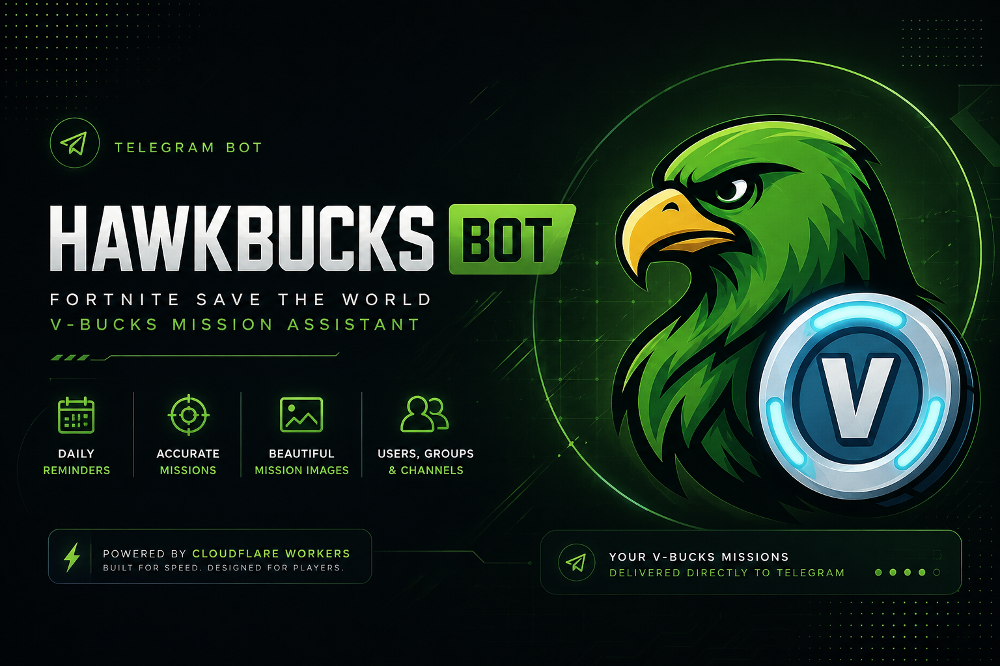

<div align="center">



# 🦅 HawkBucks Bot

### Fortnite: Save the World V-Bucks Mission Assistant for Telegram

A Cloudflare-powered Telegram bot that automatically discovers, processes, renders, and delivers **V-Bucks mission information** from Fortnite: Save the World using the **official Epic Games API**.

<br />

<p>
  <a href="#-overview">Overview</a>
  &nbsp;&nbsp;•&nbsp;&nbsp;
  <a href="#-features">Features</a>
  &nbsp;&nbsp;•&nbsp;&nbsp;
  <a href="#-how-it-works">How It Works</a>
  &nbsp;&nbsp;•&nbsp;&nbsp;
  <a href="#-architecture">Architecture</a>
  &nbsp;&nbsp;•&nbsp;&nbsp;
  <a href="#-commands">Commands</a>
  &nbsp;&nbsp;•&nbsp;&nbsp;
  <a href="#-development">Development</a>
</p>

<p>
  
  
  
  
  
  
  
  &nbsp;
  
</p>

</div>

---

## 🌿 Overview

**HawkBucks Bot** is the Telegram automation layer of the HawkBucks project.

Its purpose is simple:

> **Make today's Fortnite: Save the World V-Bucks missions available directly inside Telegram — without requiring players to manually search for them.**

The bot retrieves Fortnite mission information through the **official Epic Games API**, processes and normalizes the response, identifies V-Bucks missions, generates a player-friendly mission image, and delivers the result to subscribed Telegram users, groups, and channels.

It also provides an interactive Telegram interface for managing reminders and accessing mission information on demand.

The bot is designed as a lightweight serverless application using **Cloudflare Workers**, with **Cloudflare D1** providing persistent application state.

---

## 🎯 Why HawkBucks Bot?

V-Bucks missions in Save the World rotate regularly.

For players who actively look for these missions, repeatedly checking external websites or manually searching through mission information can be inconvenient.

HawkBucks Bot turns that process into an automated notification workflow:

```text
Epic Games API
      ↓
Mission data retrieval
      ↓
Mission parsing & normalization
      ↓
V-Bucks detection
      ↓
Mission image generation
      ↓
Telegram delivery
```

Instead of having to remember to check every day, users can receive the current mission information directly in Telegram.

---

# ✨ Features

## 💎 V-Bucks Mission Detection

The bot processes Fortnite mission information and identifies missions that contain V-Bucks rewards.

The resulting mission data includes information such as:

* V-Bucks reward
* Mission type
* Zone / area
* Power Level
* Mission details

The mission pipeline is separated into dedicated processing stages so raw source data can be transformed into a consistent internal representation.

---

## 🌐 Official Epic Games API

Mission data is retrieved through Epic Games' official Fortnite service endpoints rather than scraping third-party websites.

The bot uses a dedicated Epic API client responsible for:

* Epic device-authentication
* Access-token retrieval
* Fortnite world information retrieval
* Request timeouts
* Retry handling
* API error classification

This keeps mission acquisition independent from website layouts and HTML structures, making the data pipeline more reliable and maintainable.

---

## 🧩 Mission Data Pipeline

Mission processing is intentionally separated from Telegram-specific logic.

At a high level:

```text
Epic Games API
      │
      ▼
   Epic API Client
      │
      ▼
 Mission Parser
      │
      ▼
 Mission Normalizer
      │
      ▼
 Mission Validation
      │
      ▼
 Mission Organization
      │
      ▼
 Prepared Mission Data
```

This separation makes the mission-processing system easier to maintain, test, and extend.

---

## 🖼️ Automated Mission Images

HawkBucks Bot can transform processed mission information into a visual mission summary.

The rendering pipeline prepares the required content and uses **ScreenshotOne** to generate the final PNG image.

The generated image can then be reused across multiple recipients during the same reminder cycle.

ScreenshotOne credentials are supplied through runtime configuration and are not intended to be stored in source code.

### Mission Output Examples

The repository includes a small set of real output examples showing how HawkBucks Bot presents mission information in different states and delivery contexts.

<table>
  <tr>
    <td align="center" width="50%">
      
      <br />
      <sub><b>Multiple V-Bucks Missions</b></sub>
    </td>
    <td align="center" width="50%">
      
      <br />
      <sub><b>No V-Bucks Missions</b></sub>
    </td>
  </tr>
</table>

<p align="center">
  
  <br />
  <sub><b>Mission delivery directly inside Telegram</b></sub>
</p>

---

## ⏰ Daily Mission Reminders

The bot supports scheduled daily reminders through Cloudflare Cron.

The reminder workflow:

1. Determines the current reminder cycle.
2. Acquires the cycle in D1.
3. Retrieves eligible recipients.
4. Prepares the current mission reminder.
5. Generates or reuses the mission image.
6. Sends the reminder to recipients.
7. Records the execution state.
8. Completes the reminder cycle.

The cycle-based execution model is designed to prevent duplicate processing of the same daily reminder.

---

## 👤 Personal Reminders

Individual Telegram users can have their own reminder preferences.

User information and reminder state are persisted in Cloudflare D1.

Existing preferences are preserved when users interact with the bot again instead of being unnecessarily reset.

---

## 👥 Group & Channel Support

HawkBucks Bot supports more than private conversations.

The project includes dedicated handling for:

* Private users
* Telegram groups
* Telegram supergroups
* Telegram channels

Groups can use the bot's interactive panel to manage reminder behavior where permitted.

The reminder system keeps track of different recipient types so a single daily mission preparation can serve multiple destinations.

---

## 🎛️ Interactive Telegram Interface

The bot includes an interactive keyboard and callback-based interface rather than relying exclusively on text commands.

The Telegram layer is separated into dedicated modules for:

* Commands
* Buttons
* Keyboards
* Messages
* Groups
* Command parsing
* Telegram API communication

---

## 👑 Admin Panel

HawkBucks Bot includes a private, administrator-only control panel for monitoring and operating the bot directly from Telegram.

The Admin Panel is available only to the administrator configured through the `ADMIN_TELEGRAM_ID` Cloudflare Worker Secret and is restricted to private chats.

It currently provides:

* 📊 **Usage Statistics** — daily, weekly, monthly, 6-month, and 12-month reports.
* 🔔 **Active Reminders** — inspect users, groups, and channels with reminders enabled.
* 📨 **Broadcast Messages** — select recipients by type and filter them by reminder status or recent activity.
* 📄 **PDF Reports** — generate structured administrative reports with summary cards, activity tables, pagination, and embedded report fonts.
* 🗄️ **Cache Settings** — inspect the number of cached mission images (`SELECT COUNT(*) FROM mission_images`) and delete the entire cache after an explicit confirmation step.
* 🛡️ **Server-side authorization** — administrative callbacks are verified independently of the Telegram UI.

Broadcast delivery is designed for Cloudflare Workers' execution model: the webhook acknowledges the interaction immediately while the actual recipient delivery continues through `ctx.waitUntil()`. Delivery is isolated per recipient and failures do not stop the remaining recipients.

Custom broadcasts currently support **users and groups**. Telegram channels are intentionally excluded from custom broadcasts because they receive the scheduled daily reminder automatically.

The current free-plan implementation limits a single custom broadcast to **45 recipients**.

---

## 🗄️ Persistent Storage

Cloudflare D1 is used as the bot's persistent database.

The database stores application state such as:

* Users
* Groups
* Channels
* Reminder runs
* Mission image cache
* Panel sessions
* Admin sessions
* Broadcast history

This allows the Worker to remain lightweight while persistent configuration and runtime state are stored separately.

---

## 🛡️ Duplicate Reminder Protection

Daily reminder execution uses a cycle-based mechanism backed by D1.

Conceptually:

```text
Daily reminder
      │
      ▼
Generate cycle key
      │
      ▼
Acquire cycle in D1
      │
      ├── Already processed → Skip
      │
      └── New cycle
             │
             ▼
        Send reminders
             │
             ▼
       Complete cycle
```

This provides a persistent mechanism for controlling daily reminder execution and reducing duplicate broadcasts.

---

## ⚡ Serverless Architecture

The bot runs as a **Cloudflare Worker** rather than a traditional always-on Node.js server.

This provides:

* Serverless execution
* Scheduled Cron triggers
* D1 database integration
* Lightweight deployment
* No dedicated bot process
* Centralized runtime configuration

The Worker handles Telegram webhook requests while the scheduled handler executes the daily reminder workflow.

---

# 🤖 Commands

The bot supports different commands depending on the type of Telegram conversation.

## Private Chat

| Command    | Description                                                                  |
| ---------- | ---------------------------------------------------------------------------- |
| `/start`   | Initialize the user and open the main bot interface.                         |
| `/restart` | Reopen the main interface without intentionally resetting saved preferences. |
| `/help`    | Display private-chat help information.                                       |

---

## Groups & Supergroups

| Command  | Description                                                     |
| -------- | --------------------------------------------------------------- |
| `/help`  | Display group help information.                                 |
| `/panel` | Open the group reminder management panel when permitted.        |
| `/daily` | Access daily mission functionality through the group interface. |
| `/vbuck` | Request the current V-Bucks mission reminder immediately.       |

The bot also supports interactive callback buttons for parts of the Telegram interface.

The private-chat interface additionally exposes an **👑 Admin** entry point to the configured administrator. Administrative callback actions are authorized server-side and are not available to ordinary users.

---

# 🔔 Reminder Flow

The complete daily notification workflow can be summarized as:

```text
                 Cloudflare Cron
                       │
                       ▼
                Daily Reminder Job
                       │
                       ▼
                 Acquire Cycle
                       │
                       ▼
              Find Reminder Recipients
                       │
             ┌─────────┼─────────┐
             │         │         │
             ▼         ▼         ▼
           Users     Groups    Channels
             │         │         │
             └─────────┼─────────┘
                       ▼
              Prepare Mission Data
                       │
                       ▼
              Generate / Reuse Image
                       │
                       ▼
               Telegram Delivery
                       │
                       ▼
                 Record Results
```

The mission image can be prepared once and reused during the reminder broadcast rather than being generated independently for every recipient.

---

# 🧠 How It Works

HawkBucks Bot consists of several logical layers.

### 1. Telegram Layer

Receives Telegram updates and handles:

* Commands
* Buttons
* Group events
* Panel interactions
* User interactions

### 2. Epic API Layer

Provides a dedicated integration with Epic Games services.

Responsibilities include:

* Device authentication
* Access-token acquisition
* Fortnite world information retrieval
* Request timeout handling
* Retry handling
* API error classification

### 3. Mission Layer

Transforms Epic mission data into a normalized internal representation.

Responsibilities include:

* Mission parsing
* V-Bucks reward detection
* Power-level resolution
* Zone resolution
* Mission type/category resolution
* Deduplication
* Validation
* Mission organization

### 4. Service Layer

Contains reusable application services such as:

* Notifications
* Screenshot generation
* Recipient discovery
* Broadcast delivery
* PDF report generation
* Mission preparation
* Telegram communication

### 5. Job Layer

Contains scheduled application jobs, primarily the daily reminder workflow.

### 6. Database Layer

Provides D1 access for:

* Users
* Groups
* Channels
* Cached mission images
* Reminder execution state
* Panel sessions
* Admin sessions
* Broadcast history

### 7. Rendering Layer

Transforms prepared mission information into the visual representation delivered to Telegram.

---

# 🏗️ Architecture

At a high level, the production architecture looks like this:

```text
                    Telegram
                       │
                       │ Webhook
                       ▼
              ┌─────────────────┐
              │ Cloudflare      │
              │ Worker          │
              │                 │
              │ Telegram Layer │
              │ Mission Layer  │
              │ Service Layer  │
              │ Job Layer      │
              │ Render Layer   │
              └────────┬────────┘
                       │
            ┌──────────┴──────────┐
            │                     │
            ▼                     ▼
     Cloudflare D1          External Services
            │                     │
            │              ┌──────┼──────┐
            │              │      │      │
            │              ▼      ▼      ▼
            │           STW     Fortnite  FreeTheVbucks
            │          Planner      DB
            │
            ▼
     Persistent State
```

For mission acquisition and image generation:

```text
            Epic Games API
                   │
                   ▼
             Epic API Client
                   │
                   ▼
             Mission Parser
                   │
                   ▼
           Mission Normalizer
                   │
                   ▼
           Validated Missions
                   │
                   ▼
             HTML Renderer
                   │
                   ▼
             ScreenshotOne
                   │
                   ▼
                PNG Image
                   │
                   ▼
               Telegram
```

---

# 📁 Project Structure

```text
HawkBucks-Bot/
│
├── assets/
│   ├── banner.png
│   ├── in chat.png
│   ├── multiple missions available.jpg
│   └── no mission.jpg
│
├── database/
│   ├── admin-sessions.js
│   ├── broadcasts.js
│   ├── migrations/
│   ├── recipients.js
│   ├── schema.sql
│   ├── stats.js
│   ├── groups.js
│   └── users.js
│
├── scripts/
│   ├── deploy-d1-schema.js
│   ├── embed-assets.js
│   └── validate-deployment.js
│
├── src/
│   ├── config/
│   │   └── admin.js
│   │
│   ├── jobs/
│   │   └── dailyReminder.js
│   │
│   ├── epic/
│   │   ├── client.js
│   │   ├── localization.json
│   │   ├── mappings.js
│   │   └── parser.js
│   │
│   ├── missions/
│   │   ├── normalizer.js
│   │   ├── organize.js
│   │   ├── service.js
│   │   └── validate.js
│   │
│   ├── render/
│   │
│   ├── services/
│   │   ├── broadcast.js
│   │   └── pdf.js
│   │
│   ├── telegram/
│   │   ├── admin-broadcast.js
│   │   ├── admin-panel.js
│   │   ├── api.js
│   │   ├── buttons.js
│   │   ├── command-parser.js
│   │   ├── commands.js
│   │   ├── groups.js
│   │   ├── keyboards.js
│   │   └── messages.js
│   │
│   ├── templates/
│   │   ├── fonts/
│   │   │   ├── Inter-Report.ttf
│   │   │   └── Sora-Report.ttf
│   │   └── missions/
│   │
│   └── index.js
│
├── test/
│   ├── admin-broadcast.test.js
│   ├── admin-core.test.js
│   ├── admin-data.test.js
│   ├── callback-dispatch.test.js
│   ├── migration.test.js
│   ├── recipients.test.js
│   └── helpers/
│
├── .github/
│   ├── ISSUE_TEMPLATE/
│   │   ├── bug_report.yml
│   │   ├── config.yml
│   │   └── feature_request.yml
│   ├── workflows/
│   │   ├── ci.yml
│   │   ├── codeql.yml
│   │   └── dependency-review.yml
│   ├── CODEOWNERS
│   ├── dependabot.yml
│   └── PULL_REQUEST_TEMPLATE.md
│
├── .editorconfig
├── .gitattributes
├── .gitignore
├── .prettierrc
├── CHANGELOG.md
├── CITATION.cff
├── CODE_OF_CONDUCT.md
├── CONTRIBUTING.md
├── LICENSE
├── NOTICE.md
├── package.json
├── package-lock.json
├── REPOSITORY_HARDENING.md
├── SECURITY.md
├── SUPPORT.md
├── vitest.config.js
├── wrangler.jsonc
└── README.md
```

The repository is intentionally divided into application code, persistence,
deployment tooling, testing, and project-maintenance documentation.

---

# 🛠️ Technology Stack

| Technology                                                                                                                                          | Purpose                            |
| :-------------------------------------------------------------------------------------------------------------------------------------------------- | :--------------------------------- |
|                    | Application language               |
|  | Serverless runtime                 |
|            | Persistent SQL database            |
|                        | Local development and deployment   |
|                                | Testing                            |
|      | User and message interaction       |
|            | Mission image generation           |

---

# ☁️ Cloudflare Configuration

The Worker is configured through `wrangler.jsonc`.

The current deployment configuration includes:

* Cloudflare Worker entry point
* Node.js compatibility
* Cloudflare observability
* Source map uploads
* Daily Cron trigger
* D1 database binding
* Runtime environment variables

The scheduled trigger is configured through Cloudflare Cron and invokes the Worker's scheduled handler.

The daily reminder runs at **00:00:30 UTC every day**. Cloudflare cron triggers only support minute granularity, so the trigger fires at 00:00 UTC (`0 0 * * *`) and the scheduled handler applies a fixed 30-second delay before mission processing starts.

---

# 💻 Development

## Requirements

Before developing locally, make sure you have:

* Node.js
* npm
* Git
* A Cloudflare account for deployment
* Access to the required runtime configuration

---

## Clone the Repository

```bash
git clone https://github.com/Greenhawk5/HawkBucks-Bot.git
cd HawkBucks-Bot
```

---

## Install Dependencies

```bash
npm install
```

---

## Start Local Development

```bash
npm run dev
```

The project uses Wrangler for local Cloudflare Worker development.

---

## Run Tests

```bash
npm test
```

Vitest is used as the project's testing framework.

---

## Validate Deployment Configuration

Before production deployment, the repository includes a dedicated validation script:

```bash
node scripts/validate-deployment.js
```

This helps detect important deployment and configuration problems before they reach production.

---

# 🚀 Deployment

The repository provides dedicated deployment scripts for different deployment stages.

### Worker Deployment

```bash
npm run deploy
```

### D1 Schema Deployment

```bash
npm run deploy:d1
```

### Full Deployment

```bash
npm run deploy:full
```

For an existing production database being upgraded from the v1.0.0 baseline, apply the migration explicitly before deploying the Worker:

```bash
npx wrangler d1 execute hawkbucks-db --file database/migrations/0002_chat_last_seen.sql --remote
npm run deploy
```

The migration is non-destructive and adds the D1 structures required by the v1.1.x Admin Panel and activity tracking.

For a fresh database, apply the complete schema with:

```bash
npm run deploy:d1
```

Always review the migration and production database state before executing database changes.

---

# 🔐 Environment & Secrets

HawkBucks Bot requires runtime configuration that must **not** be committed to source control.

Depending on the deployment configuration, this may include:

* Telegram Bot Token
* Admin Panel: ADMIN_TELEGRAM_ID (numeric Telegram user ID of the primary administrator; provision as a Cloudflare Worker Secret; required for Admin Panel access; never commit the real value)
* Epic account/device credentials
* Epic token authentication credential
* ScreenshotOne credentials
* Other private API credentials
* Private service configuration

Sensitive credentials should be provided through Cloudflare secrets or appropriate environment configuration.

### Never commit:

```text
.env
.dev.vars
API keys
Telegram bot tokens
Private service credentials
Webhook secrets
```

If a secret is accidentally exposed, revoke or rotate it immediately.

For the repository's complete security practices, see:

[`SECURITY.md`](SECURITY.md)

and:

[`REPOSITORY_HARDENING.md`](REPOSITORY_HARDENING.md)

---

# 🧪 Testing & Validation

The project includes a testing foundation based on **Vitest** as well as dedicated deployment validation tooling.

The current test suite covers important parts of the application, including:

* Epic API client behavior
* Authentication and API failures
* Retry and timeout handling
* Mission parsing
* V-Buck detection
* Mission validation and normalization
* Mission organization
* Reminder-related services
* Telegram output formatting
* Admin authorization and callback dispatch
* Broadcast recipient selection, filtering, caps, and delivery
* D1 migrations and schema safety
* PDF generation, font embedding, text extraction, and layout geometry
* Regression coverage for production bugs fixed during development

The full suite currently passes **78/78 tests**.

The intended development workflow is:

```text
Change code
    ↓
Run tests
    ↓
Run deployment validation
    ↓
Review diff
    ↓
Deploy
```

Tests should be updated when behavior changes, especially around:

* Mission parsing
* Mission normalization
* Reminder execution
* Telegram interactions
* Database operations
* Rendering behavior

---

# 📦 Mission Data Sources

The production mission-acquisition path uses the **official Epic Games API**.

The repository may retain adapters or resolver code for external mission-data services for compatibility, fallback behavior, or future development, but the primary production acquisition path is intentionally based on Epic's official service rather than scraping third-party websites.

This separation keeps source-specific acquisition logic independent from the normalized mission model and Telegram delivery layer.

---

# 🗃️ Database

Cloudflare D1 provides the persistent storage layer.

The database schema includes application state for areas such as:

* Users
* Groups
* Channels
* Mission image cache
* Reminder runs
* Panel sessions

The database schema is maintained under:

```text
database/schema.sql
```

Incremental production migrations are maintained under:

```text
database/migrations/
```

The v1.1.x migration adds activity timestamps for groups/channels and the persistent Admin Panel tables without deleting or rewriting existing application data.

Database access is kept separate from Telegram handlers so persistence logic remains reusable across the application.

---

# 👑 Admin Operations

The Admin Panel is designed around a small set of safe operational workflows.

### Usage Statistics

```text
Admin
  ↓
Usage Statistics
  ↓
Select period
  ↓
Query D1 activity data
  ↓
Generate PDF report
  ↓
Send report in Telegram
```

Supported periods are:

* Today
* Current Week
* Current Month
* Last 6 Months
* Last 12 Months

### Active Reminders

The Active Reminders report summarizes recipients whose reminder setting is enabled and separates activity by recipient type.

### Custom Broadcast

```text
Admin
  ↓
Broadcast Message
  ↓
Users / Groups
  ↓
Select filter
  ↓
Select recipients
  ↓
Preview
  ↓
Confirm
  ↓
ctx.waitUntil(background delivery)
  ↓
Per-recipient delivery + summary
```

Recipient selection is revalidated server-side at send time, so the UI cannot bypass the 45-recipient limit.

Broadcast history stores delivery metadata rather than the message content.

---

# 📄 Administrative PDF Reports

The Admin Panel can generate PDF reports directly inside Telegram.

The report renderer is designed specifically for Worker-compatible execution and includes:

* Branded HawkBucks green/forest visual styling
* Summary cards for key counts
* Activity tables for users, groups, and channels
* Reminder-status reporting
* Repeating table headers across pages
* Wrapped long values without row overlap
* Embedded Inter and Sora report fonts
* PDF `ToUnicode` mappings for reliable text extraction
* Page numbering and report metadata

The renderer currently supports Latin, Latin-Extended, Greek, and Cyrillic text through the bundled report font subsets.

**Persian/Arabic text remains a known limitation:** the current lightweight renderer does not include an Arabic shaping engine and the bundled report subsets do not contain Arabic glyphs, so unsupported Arabic/Persian characters are rendered as placeholders. Telegram messages themselves are unaffected.

---

# 🖼️ Mission Image Lifecycle

Mission images follow a cache-aware workflow:

```text
Daily mission data
       │
       ▼
Prepare mission reminder
       │
       ▼
Check cached image
       │
   ┌───┴────┐
   │        │
 Cached    Missing
   │        │
   │        ▼
   │    Render HTML
   │        │
   │        ▼
   │    ScreenshotOne
   │        │
   └────┬───┘
        ▼
   Telegram image
        │
        ▼
   Reuse for recipients
```

This reduces unnecessary image-generation requests during a reminder broadcast.

---

# ⚙️ GitHub Automation

The repository includes a dedicated `.github/` configuration for automated
quality checks, dependency maintenance, issue management, and contribution
workflow.

### Continuous Integration

Every Pull Request and every push to `main` runs the project's CI workflow.

The workflow:

- Installs dependencies with `npm ci`
- Runs the Vitest test suite
- Runs deployment configuration validation

```text
Pull Request / Push
        ↓
   GitHub Actions
        ↓
    npm ci
        ↓
    npm test
        ↓
Deployment Validation
```

### 🔐 CodeQL Analysis

The repository also includes scheduled and change-triggered **CodeQL** analysis
for the JavaScript codebase to help identify potential security issues.

### 📦 Dependency Review

Pull Requests are checked for dependency-related security and licensing
changes through GitHub's Dependency Review workflow.

### 🔄 Dependabot

Dependabot is configured to periodically check:

- npm dependencies
- GitHub Actions dependencies

Dependency updates are opened as Pull Requests with appropriate labels.

### 🧩 Issue & Pull Request Templates

The repository provides structured templates for:

- Bug reports
- Feature requests
- Pull Requests

Security reports are directed toward the repository's private security reporting
process rather than public issue discussions.

### 👤 Code Ownership

`CODEOWNERS` defines the default maintainer responsible for reviewing repository
changes.

For contribution rules and the expected development workflow, see:

[`CONTRIBUTING.md`](CONTRIBUTING.md)

---

# 📚 Repository Documentation

HawkBucks Bot includes dedicated documentation for development, security, project maintenance, and community participation.

| File                                                 | Purpose                                            |
| ---------------------------------------------------- | -------------------------------------------------- |
| [`CONTRIBUTING.md`](CONTRIBUTING.md)                 | Development workflow and contribution guidelines   |
| [`CODE_OF_CONDUCT.md`](CODE_OF_CONDUCT.md)           | Community standards and expected behavior          |
| [`SECURITY.md`](SECURITY.md)                         | Security policy and vulnerability reporting        |
| [`REPOSITORY_HARDENING.md`](REPOSITORY_HARDENING.md) | Repository and deployment security baseline        |
| [`SUPPORT.md`](SUPPORT.md)                           | Bug reports, troubleshooting, and support guidance |
| [`CHANGELOG.md`](CHANGELOG.md)                       | Version history and notable changes                |
| [`CITATION.cff`](CITATION.cff)                       | Citation metadata for the project                  |
| [`NOTICE.md`](NOTICE.md)                             | Third-party, trademark, and project notices        |
| [`LICENSE`](LICENSE)                                 | MIT open-source license                            |
| [`.gitattributes`](.gitattributes)                   | Repository text normalization and file handling    |
| [`.github/`](.github/)                               | CI, security automation, issue templates, and repository workflow |

These files are maintained separately from application code to keep the project organized while providing a clear foundation for future development and collaboration.

---

# 🤝 Contributing

Contributions, suggestions, and improvements are welcome.

Before contributing, please read:

[`CONTRIBUTING.md`](CONTRIBUTING.md)

The general workflow is:

1. Create a focused branch.
2. Make the required changes.
3. Run the relevant tests.
4. Run deployment validation when applicable.
5. Review the final diff.
6. Ensure no secrets or generated files are included.
7. Open a Pull Request with a clear description.

Recommended branch naming includes:

```text
feature/...
fix/...
refactor/...
docs/...
test/...
```

Keep Pull Requests focused and avoid unrelated changes.

---

# 🐛 Issues & Support

For reproducible bugs and feature discussions, use GitHub Issues where appropriate.

Before opening an issue, check existing discussions and the project documentation.

When reporting a bug, include:

* What you were trying to do
* What happened
* What you expected
* Steps to reproduce
* Relevant error messages
* Relevant non-sensitive logs
* Affected component, when known

For additional guidance, see:

[`SUPPORT.md`](SUPPORT.md)

### Security Issues

**Do not open a public GitHub Issue for a security vulnerability.**

Follow the instructions in:

[`SECURITY.md`](SECURITY.md)

---

# 🔒 Security

Security is treated as part of the development process rather than a final cleanup step.

The repository specifically aims to prevent:

* Credential exposure
* Unsafe Telegram logging
* Unsafe database access
* Unvalidated external data
* Accidental publication of local configuration
* Unnecessary production attack surface

For the complete security policy:

[`SECURITY.md`](SECURITY.md)

For the repository hardening checklist:

[`REPOSITORY_HARDENING.md`](REPOSITORY_HARDENING.md)

If a credential is exposed, revoke or rotate it immediately.

---

# 📋 Changelog & Releases

Project changes are documented in:

[`CHANGELOG.md`](CHANGELOG.md)

The changelog follows a structure inspired by **Keep a Changelog**, with version information maintained as the project evolves.

The current release baseline is:

```text
1.2.0
```

The project follows Semantic Versioning for releases where practical.

Version 1.2.0 includes the corrected Save the World mission Power Level resolution (current Epic difficulty tiers, Canny Valley correction, and group-mission difficulty rows), the Admin Panel Cache Settings for mission image cache inspection and confirmed deletion, the 00:00:30 UTC daily reminder schedule, and related regression tests.

---

# 📖 Citation

If you use HawkBucks Bot in academic work, research, documentation, or another project, citation metadata is available in:

[`CITATION.cff`](CITATION.cff)

The repository's citation information is intended to make attribution easier while keeping the project identity and source repository clearly defined.

---

# 🧭 Project Philosophy

HawkBucks Bot follows a few simple engineering principles.

### 🎯 Focused

The bot exists for one primary purpose:

> **Deliver useful V-Bucks mission information to Fortnite: Save the World players.**

### 🧩 Modular

Telegram handling, mission processing, rendering, persistence, and scheduled jobs are separated into dedicated modules.

### ⚡ Lightweight

The application is designed around Cloudflare's serverless infrastructure rather than a permanently running application server.

### 🔄 Reliable

Mission data is obtained through the official Epic Games API rather than depending on third-party website structures or HTML scraping.

### 🛡️ Security-Conscious

Secrets and credentials belong in runtime configuration, not in the repository.

### 🤖 Automated

Testing, deployment validation, dependency review, and code-security analysis
are integrated into the repository workflow through GitHub Actions.

---

# 🗺️ Roadmap

HawkBucks Bot is actively evolving.

Potential future improvements include:

* [ ] Expanded automated test coverage
* [ ] Improved operational diagnostics
* [ ] More granular reminder preferences
* [ ] Improved mission history and caching
* [ ] Additional Telegram interaction features
* [ ] Further rendering improvements
* [ ] Expanded documentation

The roadmap may change as the bot and the wider HawkBucks ecosystem evolve.

Completed in the current 1.1.x line:

* [x] Private administrator-only Admin Panel
* [x] Usage and active-reminder PDF reports
* [x] Filtered custom broadcasts with server-side recipient limits
* [x] D1 migration support for activity and Admin Panel state
* [x] Regression coverage for the production callback and broadcast paths

---

# ⚠️ Disclaimer

**HawkBucks Bot is an independent community project.**

It is **not affiliated with, endorsed by, or sponsored by Epic Games or Fortnite**.

Fortnite and V-Bucks are trademarks of Epic Games, Inc.

HawkBucks Bot is intended to provide a convenient community tool for accessing Fortnite: Save the World mission information.

---

# 🦅 About HawkBucks

The HawkBucks project is built around a simple idea:

> **Find the mission. See the reward. Never miss the V-Bucks.**

The Telegram bot extends that idea into an automated notification experience, allowing mission information to reach players directly where they already communicate.

---

<div align="center">

## HawkBucks Bot

**Fortnite: Save the World V-Bucks Mission Assistant**

<br />

*Built with Cloudflare Workers, D1 and Telegram.*

<br />

🦅 **Find the V-Bucks. Track the missions. Never miss a reward.**

</div>
